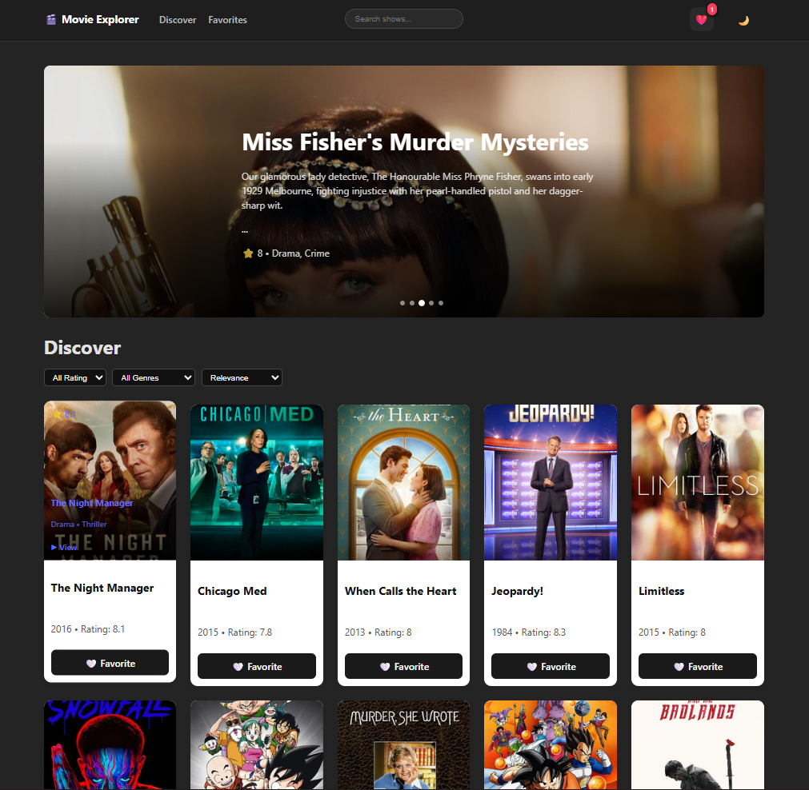
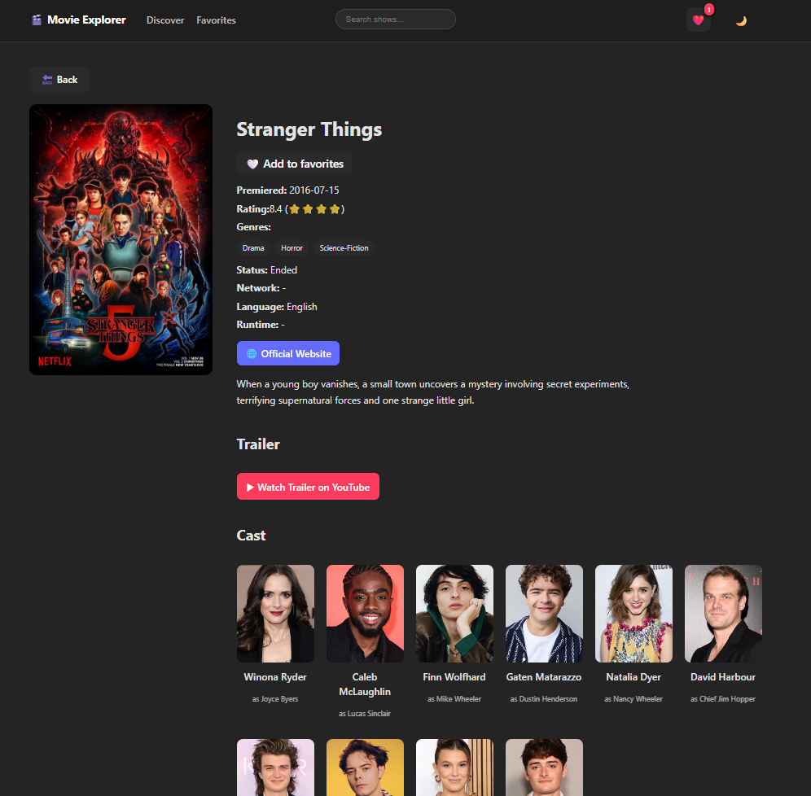
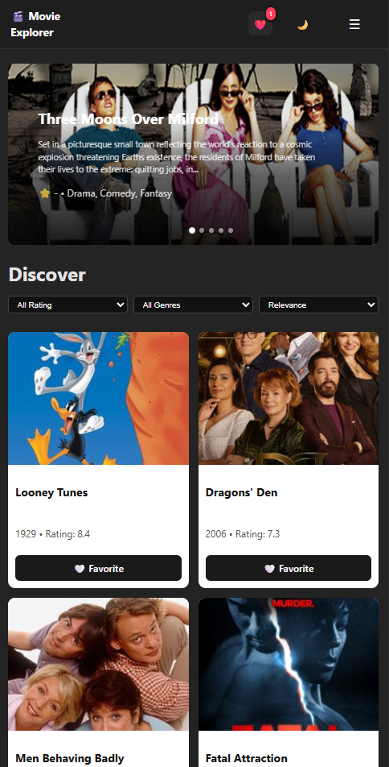
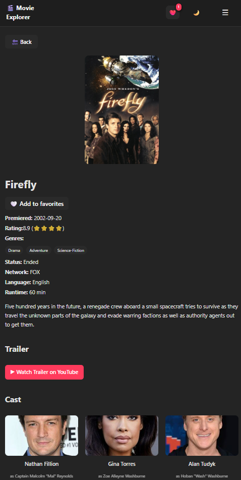

# 🎬 TV Shows Explorer

A modern **React web application** to explore TV shows using the TVMaze API.

Users can search shows, discover trending content, filter by genre and rating, view detailed information, and save favorites.

---

# ✨ Features

* 🔍 **Debounced Search** for better performance
* 🎬 **Discover Shows** with infinite scrolling
* ⭐ **Filter by Rating**
* 🎭 **Filter by Genre**
* ❤️ **Add / Remove Favorites**
* 📄 **Detailed Show Page**
* ⏳ **Skeleton Loading UI**
* 📱 **Responsive Design (Mobile Friendly)**

---

# 🛠 Tech Stack

* React
* React Router
* JavaScript (ES6+)
* CSS
* TVMaze API

---

# 📷 Screenshots

## Discover Page



## Show Details



## Mobile View



## Mobile Detail



---

# 🚀 Installation

Clone the repository

```
git clone https://github.com/YOUR_USERNAME/tv-show-explorer.git
```

Install dependencies

```
npm install
```

Run development server

```
npm run dev
```

---

# 🌐 API

This project uses the **TVMaze API**

https://api.tvmaze.com

---

# 📌 Author

Built with ❤️ using React.
